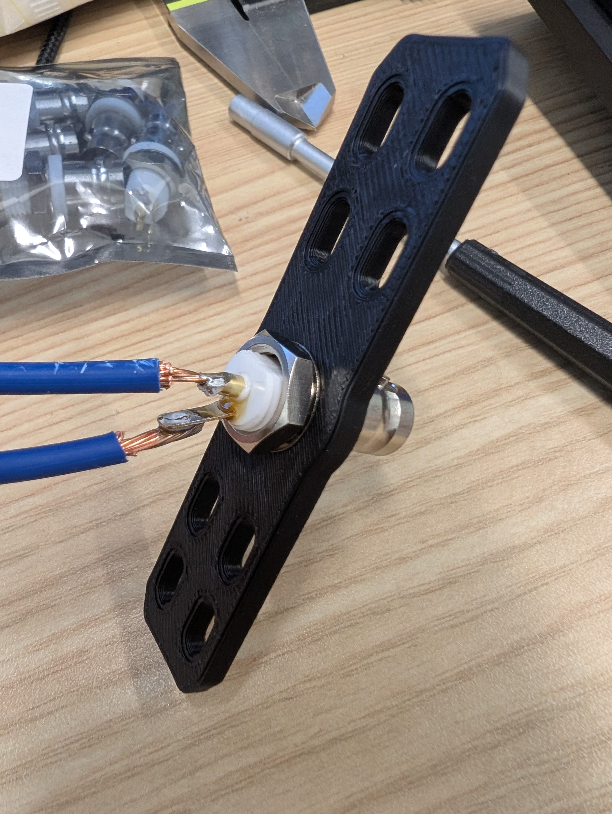
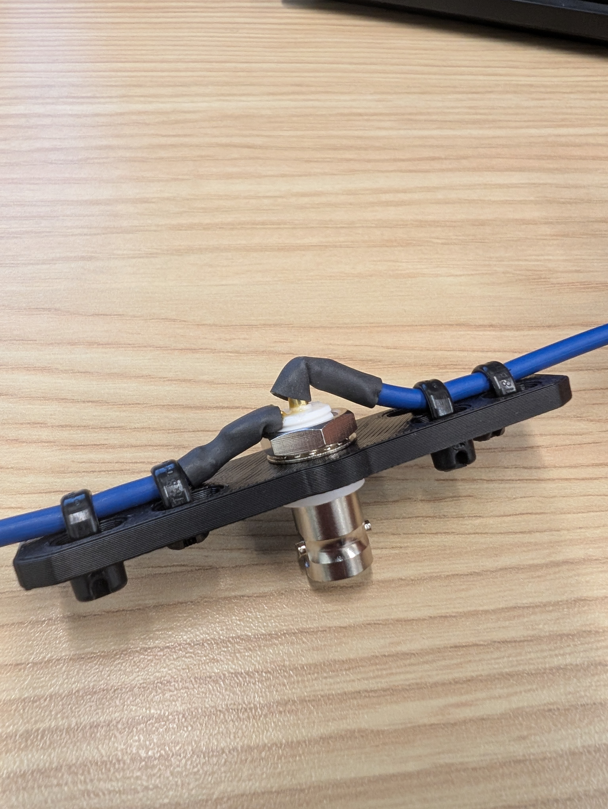
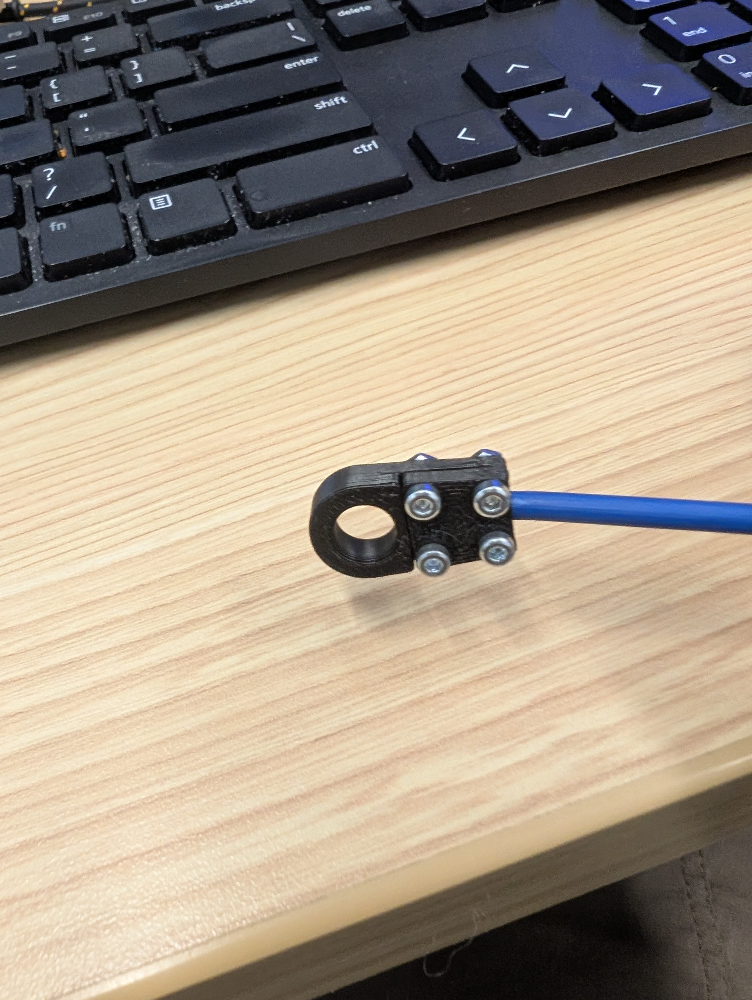
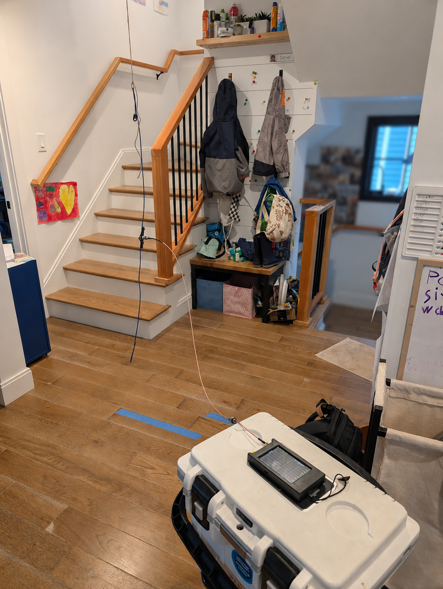
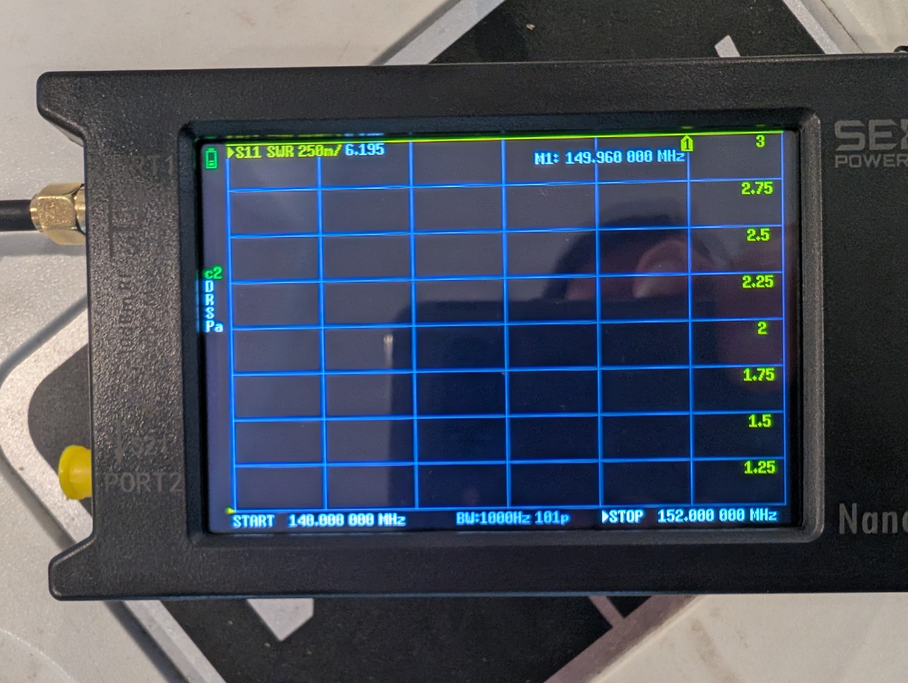
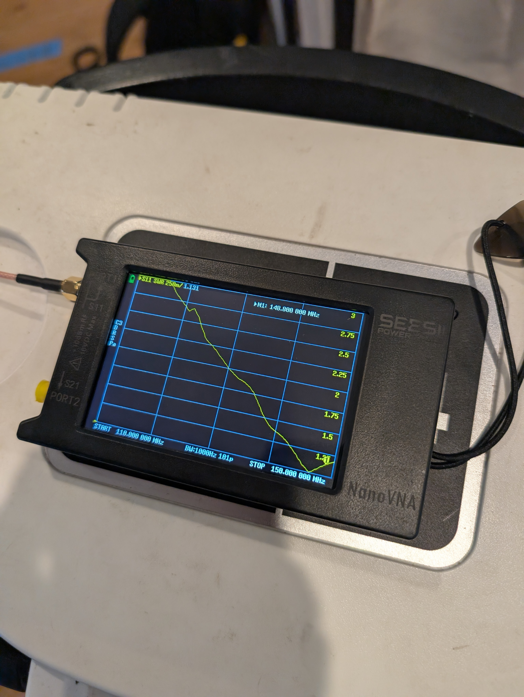

# Building my first _working_ antenna

I'm super pumped about building my own antennas. There's something magical about being able to communicate with others at a distance via hardware _I_ made. Hardware that is comprised of an accurately measured and cut length of wire, and that resonates at the correct frequency range. It feels so good, man. And it's also so niche, even for an engineer! There has to be only a very small group of people that cares about this in the whole world. So I'm very interested in building my skills to earn my place amongst these dark wizards. 

The very first thing I ever tried was a dual band Yagi antenna to work the repeater on the space station, but man that was _not_ the right starter project. I will post about it when I make it work.

There are too many little details and nuances that need to be done _just right_ in ddition to having basic making and hacking skills (which is what I originally thought I needed): materials, connectors, sizes, lengths, connectors, you name it. Every single detail about how the antenna is built and isntalled plays a critical role on ending up with an antenna that will work _at all_, or just an interestingly-looking piece of metal. And even more in making it work _well_.

So, after a confusing failure with the Yagi, I decided to put that project on the back burner for a moment and focus on something more attainable. I looked at a few different designs, and landed on a center-fed dipole antenna for the 2m band. It is simple, compact yet forgiving enough, and requires a bit more work and diligence than a simple monopole, so I got to work.

## Scaling back
As always, my mind went a little bit too far too fast and got some aluminum rods from the home depot and fired up the computer to CAD an articulated hub for a stowable antenna, but after a bit of thinking I decided to pull back the scope and start with an even simpler version: a dipole made with two lengths of electrical wire.

## Antenna design
I'm bulding a center-fed, half-wave dipole for the 2m band, it is designed to be mounted vertically for vertical polarization. This configuration should give me good performance for the local 2m repeaters and simplex.

To calculate the length of the wire segments I went with the basic formula 
$$\lambda = \frac{c}{f}$$

I want the antenna centered on 146.52 MHz (simplex calling freq for 2m), and assuming ${c}=300$ this gives a length of:

$$\lambda = \frac{300}{146.52} = {2.05m}$$

Since this is a half-wave, the total antenna length $\frac{\lambda}{2}$ and each half of the dipole's length is approx $\frac{2.05m}{4}={0.51m}$

So I started with that amount of wire on each side and expected to trim down once tuning with the nanoVNA.

I grabbed a couple of lengths of 12 AWG wire I had lying around in the shop. It's quite beefy for an antenna like this, but it should help with bandwidth and sensitivity.

## Making the antenna
I designed and printed a central "hub" to hold a panel mounted BNC connector and to provide some structure, fastening and stress relief for the wires.

  
  

I soldered the wire halves directly onto the BNC connector. Since I chose a wire that is perhaps too big, soldering the center wire was kind of tricky. Next time I'll pick something thinner and much more flexible than this one so the wires are easier to solder and don't want to curve so hard when installed. I applied heat shrink to protect the solder joints and zip-tied the wire halves to the hub. I gave it a pretty good tug test and the wires didn' move. Good to go.

This antenna needs to be installed in a vertical orientation, and since the wire is not structural and the antenna will rather need to be hung, I also printed two little clamps to perform as hooks and allow me to hang the antenna.

    

I added a channel for the wire so when the clamp is screwed together the wire is bitten by the clamps and they don't detach. The clamps are made of PLA and the tiny M2 screws are not electrically connected to the wire, so there should be no significant effect on the antenna performance.

## Time to test!

### The nanoVNA
I have a relatively cheap nanoVNA I got from [Amazon](https://www.amazon.com/dp/B085CFHTBM). I didn't want to spend the big bucks just yet, so we're yet to see if I need to regret any life decisions. 

This was my first time actually using the nanoVNA for tuning rather than just to click around on the screen, and I gotta say: Once the workflow is known, this is an awesome device. But it's a very convoluted UI and the device comes with no manual, so it's a PITA to get to become familiar with such workflow. Had to rely hard on chatGPT to understand how to use this thing... but now I love this thing! It's awesome to be able to know how well the antenna performs and whether it's safe to use with my radio or not.

I think I'll write a post on how to use it. Or maybe make a video or something. Anyway, time to test!

I hung the antenna from my ceiling with a bit of painters tape and enough string to keep the antenna as centered on my living room as possible, while putting the BNC connector at a convenient height. With the antenna being so light, I didn't need to worry about any fancy mounting solution. The pic below shows how my setup looked like. 

<figure style="text-align: center;">
    

        
    

    <figcaption> Ignore the mess, ha!</figcaption>
</figure>

After calibrating the VNA with a 3' coax jumper, I hooked it to the antenna and did a first sweep between 140M and 150M, and saw a pretty bad SWR (~6!). I shortened the halves by bending the wire on itself. The bent lengths don't form part of the antenna anymore, and this made it really convenient for quick iteration. 

<figure style="text-align: center;">
    

        
    

    <figcaption>Pretty bad SWR of flat ~6:1</figcaption>
</figure>

After a couple of tries, that involved increasing the swept frequency range from 110M to 150M to see more of the picture, I finally eneded with a pretty decent dip at the right frequency!

<figure style="text-align: center;">

    

<figcaption>Nice dip at ~146MHz!</figcaption>
</figure>

I had to step back every time I wanted the VNA's reading to stabilize, which is sign that the antenna is not fully balanced and the coax is part of it. I tried coiling a choke with the coax, but I only have 3' so can't do much, and whatever I could coil made the reading a bit more stable, but detuned the antenna _a lot_. I should get a set of mix 43 ferrites.

Once I saw I had a good SWR @ 2m, I hooked up my HT (an AnyTone AT-D878UVII Plus), and tuned to the local [WIBOS repeater](https://www.repeaterbook.com/repeaters/details.php?state_id=25&ID=11451) and heard some activity, but I wasn't able to open the repeater (no tail, no CW ID back), so I was a bit disappointed, but then decided to test it outside and it was a great success!

I called CQ on the 2m simplex and got a contact from a local HAM [N1OSG (Andy)](https://www.qrz.com/db/N1OSG). He reported I came with 59 and I got him with equal strenght and clarity. I had already worked his station using the SignalStuff stick, but it had been kinda noisy, so I was really happy with the quality of that first contact! Andy helped me work the local repeaters and reported how well my signal came through. We worked the 2m repeaters, but had to skip the 70cm ones, because I measured INF SWR around 430MHz. 

So, I built a pretty decent 2m dipole, not a dual-band dipole. Still, pretty good!

## Lessons learned?
**Yes:**
- The nanoVNA is super useful. Learn how to use it well and efficiently
- The length of the leads between the BCN and the radiant elements actually forms part of the antenna, so either measure them and add them to the element's length, or make them basically 0 (less critical for the lower bands)
- The antenna is not fully balanced, so there's some current flowing on the coax. Get some ferrites!

## Future projects?
**YES!**
I'm going to basically build the same antenna, but the way I had originally imagined it: With rods instead of wires, and add some sort of pivot point to the hub so the antenna is nicely portable.

73, KC1ZTY out.
